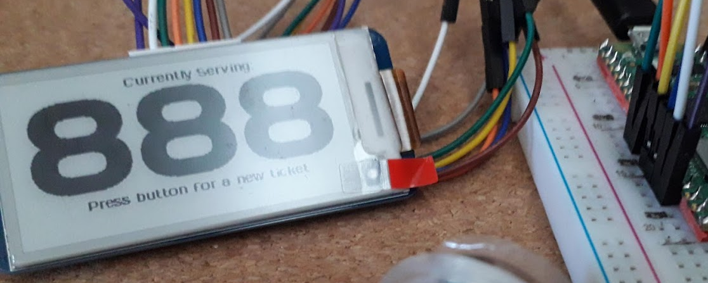
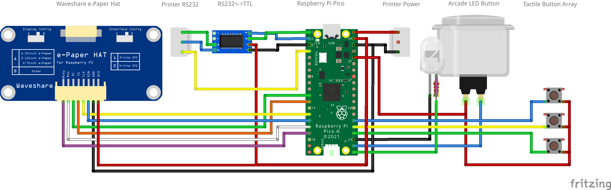
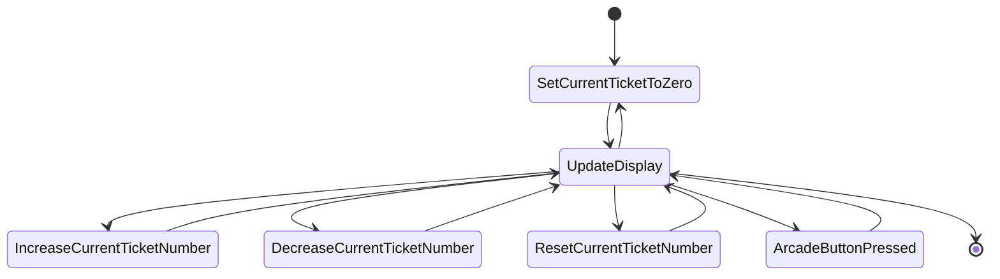
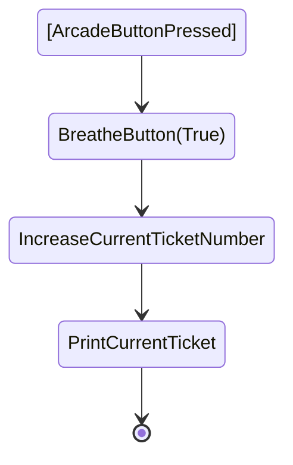
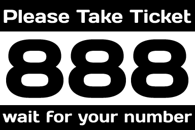
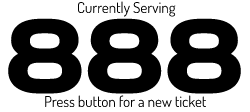
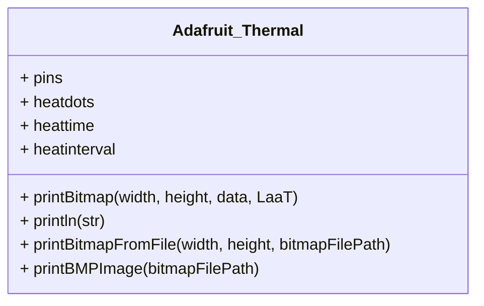

# Take A Ticket

## Overview

So, you know those times when someone turns up at your desk and either just hovers there till you're ready, or breaks your flow when you're in teh middle of something?
Even worse is when you're already talking to someone and they just cut in as if they have the power to somehow automatically know out of the two conversations which one holds the precedence?
..ever wish you could actually have a ticket machine so you can say 'take a ticket' and point to it?

Well here it is.

## Setting up, playing around and testing

## Micropython

The Pico should be flashed with MicroPython (perfect for a good cobbling), you can find it here:

 - Pico https://micropython.org/download/rp2-pico/
 - Pico W https://micropython.org/download/rp2-pico-w/

Download the latest .uf2 for either a Pico or a Pico-W (if it has wifi it's a Pico-W), hold the button down on the Pico, then plug in the USB. Copy and Paste the .uf2 file you downloaded to the new usb drive that just appeared and when it's finished copying over the Pico will reboot into MicroPython mode, simple as that.

### Thonny

There's more than enough tutorials out there for this, but short story, install the latest version of Thonny you can lay hands on, run it, in `Run`->`Configure Interpreter` menu item go to the `Interpreter` tab, set the top dropdown to `MicroPython (Raspberry Pi Pico)`.

To upload a file from this repo to a Pico, open it in Thonny then select the menu item `File`->`Save Copy`, pick `Raspberry Pi Pico` then save it as the same name.
To run a Python file on the Pico, open it (either locally from a file or from teh Pico itself) simply have it as the active open file and press Run (or F5).
To edit a file open it from the Pico, make the changes and save it again, it will automatically save to the Pico. 

### VSCode

For this I think the `Pico_W_Go` extension is perfect: https://marketplace.visualstudio.com/items?itemName=paulober.pico-w-go 
This repo is already set up for it (works on my machine) so if you want to try it, load it up into VSCode and see if it works!

### Putting the code on the board
In Thonny go to View -> Files, open the `src` on local and uplaod all the files in there to the Pico

In VSCode, in the file Explorer there will also be a PICO Remote Workspace, which is the filetable on the Pico, copy the files in the `src` directory to the Remote Workspace..

It's that easy.

### Testing the code

Load the file in Thonny or VSCode and run it:
 - Thonny - press the green run button in the top toolbar, or press F5
 - VSCode - press the run button in the bottom toolbar

 Seriously, I *told* you it was easy... 
 Debugging is trickier, I'll be honest, but managing files and testing? There's no flashing or anything, you just *run it*. 

## List of Materials

Not a 'Bill of Materials' because this is just cobbled together, find the cheapest versions.
 
 - Raspberry Pico (W or old school, it doesn't matter, we don't need any wireless where we're going)
 - E-Paper display (we used a Waveshare 2.13 PHat, because it was cheap and had nice breakouts fo the SPI pins)
 - Button (we used a LED backlit transparent one, because it was pretty)
 - Serial/TTY Thermal Printer (we got the cheapest we could find that had a serial connection)
 - 3 X generic tactile switches 

### E-Paper finaglery

Just basic text is fine on a E-Paper if you're happy with the font being 8 pixels high, but we are not. The current ticket number must be as readable as possible, so we need to use some extra cleverness to use 'fonts'. The fonts can be created using PeterHinh's very excellent `font_to_py` python application: https://github.com/peterhinch/micropython-font-to-py
The documentation there is remarkably good but for a sum-up, I got the Days font from dafont: https://www.dafont.com/days.font and then I used `font_to_py` against it to create two sizes of the font at 10 pixels and 75 pixels height using the following in cli:
 - python font_to_py.py -x days.ttf 75 days_font_83.py -c 1234567890 days_font_83.py
 - python font_to_py.py -x days.ttf 10 days_font_10.py

 Explanation of the `font_to_py` switches:
  - -x renders the font horizontally
  - -c 1234567890 causes only the numbers 0-9 to be rendered, these are the only characters I need so best to save file space

  So, when we have the python fonts these can be uploaded to the board and imported in as libraries in the normal fashion.

  Then to actually use them we can use the main Waveshare library to setup the E-Paper module itself, then halfway through the process create a sub-frame buffer that can then be mixed with Peter Hinch's other very excellent library `writer`. 
  This library is best thought of as a middleware for a framebuffer, it enables you to do additional things to it that you don't get out of the box. This is preffered here as it means we don't need to break out the big guns on an expensive canvassing framework like `Pillow` etc.. and no that's not a slight, I love using `Pillow`, it's very natural but literally the only thing that `frameBuffer` doesn't give us is pixel fonts.

### Serial Printer

The printer I managed to find appears to be this one: [Adafruit Mini Thermal Printer](https://www.adafruit.com/product/597).

This is excellent as Adafruit usually has great 'getting started' examples for wiring, code examples and walkthrough's. 
Adafruit does mostly prefer to push their own CircuitPython solutions rather than the MicroPython that we are interested in, however being as they are both based on Python (obvs..) if the default libraries are not compatible with MicroPython and there doesn't seem to be examples available for MicroPython we can dive into the detail on how they solved problems from their CircuitPython libraries to make up a solution for us, lokos good with an early look as I found a port to the Adafruit CircuitPython library to MicroPython [here](https://github.com/ayoy/micropython-thermal-printer).

Serial Thermal Printers tend to support printing a handfull of built in fonts but also bitmaps sent to them. We are interested in the fonts if they are usable (50/50 in my experience), but we absolutely need bitmap as it's through this we'll take our font ([`assets/days.ttf`](https://www.dafont.com/days.font), render the current ticket into a image object at the correct font size, along with any messaging, and then pass that image directly to the printer. Took a bit of digging but the max pixel width on this printer appears to be [`384 pixels`](https://www.marutsu.co.jp/contents/shop/marutsu/ds/mini-thermal-receipt-printer.pdf). I'll know more when they arrive.

#### Pins

This may well not be the same for anything other than the Waveshare 2.13 V3 PHat, do your research.
The following table was taken from : https://www.waveshare.com/wiki/Pico-ePaper-2.13

| E-Paper | Pico | Description |
|---|---|---|
| VCC | VSYS | Power input |
| GND | GND | Ground |
| DIN | GP11 | MOSI pin of SPI interface, data transmitted from Master to Slave. |
| CLK | GP10 | SCK pin of SPI interface, clock input |
| CS | GP9 | Chip select pin of SPI interface, Low Active |
| DC | GP8 | Data/Command control pin (High: Data; Low: Command) |
| RST | GP12 | Reset pin, low active  |
| BUSY | GP13 | Busy pin, low active  |

*Raspberry Pico Pinout sheet from raspberrypi.com*

So we now have a E-Paper display that can display some text in a font and size we specify. That's one half of the heavy lifting and leaves us with:

- LED backed button: lets have a pretty `breathe` animation when the unit is printing a ticket, otherwise the LED is turned off, LED Pin will be GPIO 16
- 3 tac buttons, button 1 resets the ticket number to 000, therefore when the button is next pressed it prints 001, button 2 decreases the number, button 3 increases the number
- Serial Thermal Printer - TBD (still on the long boat from AliExpress)

### Putting it all together

Wiring Diagram for the components

### Application flows

#### State Diagram 

**Overview**

---
#### Functions

**`SetCurrentTicketToZero` Function**
 - when the application is started the `current_ticket_number` should be set to the `minimum_ticket_number_value` (000)

**`UpdateDisplay` function**
 - update the e-Paper screen to display the current_ticket_number to look like the below e-paper screen example template
 - BreatheButton(False)

**`IncreaseCurrentTicketNumber` Function**
 - adds `1` to the current_ticket_number variable, if current_ticket_number is equal to the `maximum_ticket_number_value` (999), set the current_ticket_number to the `minimum_ticket_number_value` (000)

**`DecreaseCurrentTicketNumber` Function**
 - decrements `1` from the current_ticket_number variable, if current_ticket_number is equal to the `minimum_ticket_number_value` (000), set the current_ticket_number to the `maximum_ticket_number_value` (999)

**`ResetCurrentTicketNumber` Function**
 - sets the current_ticket_number variable to the `minimum_ticket_number_value` (000)

**`ArcadeButtonPressed` Function**
 - run `BreatheButton(True)` Function
 - run `IncreaseCurrentTicketNumber`Function
 - run `PrintCurrentTicket` Function
 - run `BreatheButton(False)` Function

**`BreatheButton` Function (args[Enabled=True (default value)])**
- If Enabled:
  - slowly ramp brightness of LED up to maximum
  - slowly ramp brightness of LED down to minimum
- if Disabled:
  - set LED value to Off

**`PrintCurrentTicket` Function**
 - a ticket bitmap is sent to the Serial Printer displayed using the below printed ticket example (888 being replaced with the current ticket number, which ranges from 000 to 999)

---

## Templates, Diagrams and other tat

*printed ticket example: char "8" is usually the widest number in a font, printer max pixel width is 384 pixels, so this image canvas is 384X256*

*e-paper screen example*

*Class diagram for the Adafruit_Thermal library*

---

UpdateDisplay

PrintCurrentTicket
NewTicketRequested
BreatheButton
