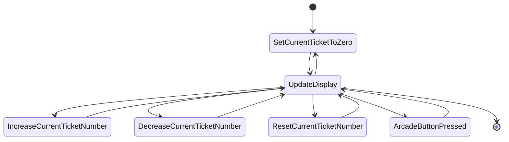
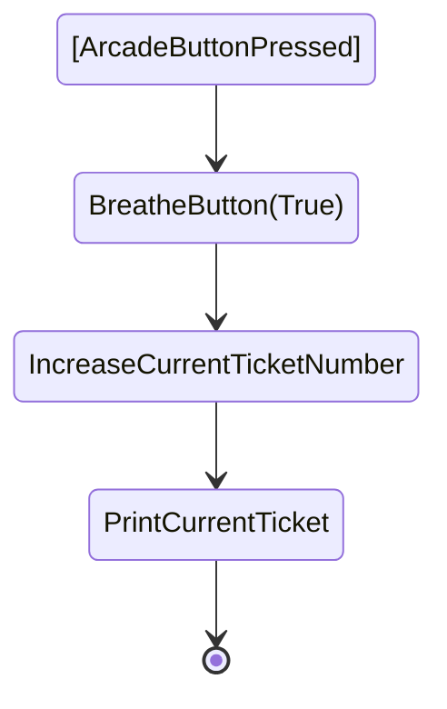
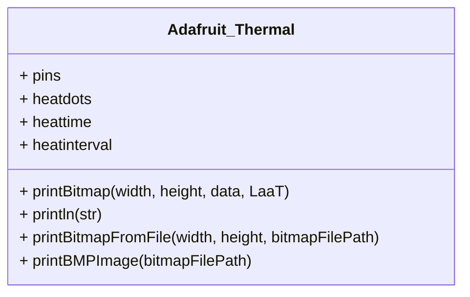

# Take A Ticket

## Overview

So, you know those times when someone turns up at your desk and either just hovers there till you're ready, or breaks your flow when you're in teh middle of something?
Even worse is when you're already talking to someone and they just cut in as if they have the power to somehow automatically know out of the two conversations which one holds the precedence?
..ever wish you could actually have a ticket machine so you can say 'take a ticket' and point to it?

Well here it is.

## Setting up, playing around and testing

## Arduino / Platform.io
### Arduino? awwww why not Python?
The original solution was going to use MicroPython but the Adafruit Thermal Printer libraries don't support printing bitmap images and this is an excercise in fun rather than programming to fix it, so next best option is Arduino. 

### Setting up the Arduino 2 IDE
 1. Plug the Pico into USB
 2. Download it from here and install it: [download](https://www.arduino.cc/en/software)
 3. Add the Pico board to the Board Library: File->Preferences->Additional boards manager URLS: `https://github.com/earlephilhower/arduino-pico/releases/download/global/package_rp2040_index.json`
 4. Add the Pico board: Tools->Board->Board Manager, Search `pico` and select `Raspberry Pi Pico/RP2040` and install it
 5. Select the Serial Port the Pico is connected to 
...and you are done

If you want to test it's working properly, go into File->Examples and grab `blink`, verify and upload it to the board. Does the LED turn off and on every second? Everything worked! It didn't? oh that's a shame, best you go google that.

### VSCode
There is a extension called `platform.io` that you can add to VSCode to use instead of the Arduino IDE. It's way outside the scope of this, if you want to, go google how to set it up. Aside of the different IDE it doesn't change anything with the code or capabilities of the Pico, so again, your choice.

## List of Materials

Not a 'Bill of Materials' because this is just cobbled together, find the cheapest versions.
 
 - Raspberry Pico (W or old school, it doesn't matter, we don't need any wireless where we're going)
 - E-Paper display (we used a Waveshare 2.13 PHat, because it was cheap and had nice breakouts fo the SPI pins)
 - Button (we used a LED backlit transparent one, because it was pretty)
 - Serial/TTY Thermal Printer (we got the cheapest we could find that had a serial connection)
 - 3 X generic tactile switches 

### E-Paper finaglery

Just basic text is fine on a E-Paper if you're happy with the font being 8 pixels high, but we are not. The current ticket number must be as readable as possible, so we need to use some extra cleverness to use 'fonts'. The fonts can be created from TTF fonts using the [truetype2gfx](https://rop.nl/truetype2gfx/), there is a Adafruit article on it here: [Adafruit truetype2gfx](https://blog.adafruit.com/2021/11/04/truetype2gfx-converting-fonts-from-truetype-to-the-adafruit-gfx-library-for-arduino/).
I got the Days font from dafont: https://www.dafont.com/days.font and then I used `truetype2gfx` against it to create two sizes of the font at 10 pixels and 75 pixels height.

So, when we have the gfx fonts these can be uploaded to the board and imported in as libraries in the normal fashion.

Then to actually use them we can use the main Waveshare library to setup the E-Paper module itself, then when we write to the E-Paper we tell it what to write and which gfx font to use. 

### Serial Printer

The printer I managed to find is the RS232 variant of one of these: [Adafruit Mini Thermal Printer](https://www.adafruit.com/product/597).

This is excellent as Adafruit usually has great 'getting started' examples for wiring, code examples and walkthrough's. 
Adafruit does mostly prefer to push their own CircuitPython solutions rather than the MicroPython that we are interested in, however being as they are both based on Python (obvs..) if the default libraries are not compatible with MicroPython and there doesn't seem to be examples available for MicroPython we can dive into the detail on how they solved problems from their CircuitPython libraries to make up a solution for us, lokos good with an early look as I found a port to the Adafruit CircuitPython library to MicroPython [here](https://github.com/ayoy/micropython-thermal-printer).

Serial Thermal Printers tend to support printing a handfull of built in fonts but also bitmaps sent to them. We are interested in the fonts if they are usable (50/50 in my experience), but we absolutely need bitmap as it's through this we'll take our font ([`assets/days.ttf`](https://www.dafont.com/days.font), render the current ticket into a image object at the correct font size, along with any messaging, and then pass that image directly to the printer. Took a bit of digging but the max pixel width on this printer appears to be [`384 pixels`](https://www.marutsu.co.jp/contents/shop/marutsu/ds/mini-thermal-receipt-printer.pdf). I'll know more when they arrive.

Now, remember when I said it was a RS232 variant of a Mini Thermal Printer?
That complicates things massively for me, as the RS232 protocol does essentially talk using Serial/TTY commands, but the voltage is variant (not fixed to either 3.3 or 5 volts) and near as I can understand it the signal is inverted. Luckily there is a MAX3232 chip that is specifically designed to convert between RS232 and TTL, so with one of these on a tidy breakout board between the printers data cable and the picos tty pins and it works as expected. 

#### Pins

This may well not be the same for anything other than the Waveshare 2.13 V3 PHat, do your research.
The following table was taken from : https://www.waveshare.com/wiki/Pico-ePaper-2.13

| E-Paper | Pico | Description |
|---|---|---|
| VCC | VSYS | Power input |
| GND | GND | Ground |
| DIN | GP11 | MOSI pin of SPI interface, data transmitted from Master to Slave. |
| CLK | GP10 | SCK pin of SPI interface, clock input |
| CS | GP9 | Chip select pin of SPI interface, Low Active |
| DC | GP8 | Data/Command control pin (High: Data; Low: Command) |
| RST | GP12 | Reset pin, low active  |
| BUSY | GP13 | Busy pin, low active  |

*Raspberry Pico Pinout sheet from raspberrypi.com*

So we now have a E-Paper display that can display some text in a font and size we specify. That's one half of the heavy lifting and leaves us with:

- LED backed button: lets have a pretty `breathe` animation when the unit is printing a ticket, otherwise the LED is turned off, LED Pin will be GPIO 16
- 3 tac buttons, button 1 resets the ticket number to 000, therefore when the button is next pressed it prints 001, button 2 decreases the number, button 3 increases the number
- Serial Thermal Printer - TBD (still on the long boat from AliExpress)

### Putting it all together

Wiring Diagram for the components

### Application flows

#### State Diagram 

**Overview**

---
#### Functions

**`SetCurrentTicketToZero` Function**
 - when the application is started the `current_ticket_number` should be set to the `minimum_ticket_number_value` (000)

**`UpdateDisplay` function**
 - update the e-Paper screen to display the current_ticket_number to look like the below e-paper screen example template
 - BreatheButton(False)

**`IncreaseCurrentTicketNumber` Function**
 - adds `1` to the current_ticket_number variable, if current_ticket_number is equal to the `maximum_ticket_number_value` (999), set the current_ticket_number to the `minimum_ticket_number_value` (000)

**`DecreaseCurrentTicketNumber` Function**
 - decrements `1` from the current_ticket_number variable, if current_ticket_number is equal to the `minimum_ticket_number_value` (000), set the current_ticket_number to the `maximum_ticket_number_value` (999)

**`ResetCurrentTicketNumber` Function**
 - sets the current_ticket_number variable to the `minimum_ticket_number_value` (000)

**`ArcadeButtonPressed` Function**
 - run `BreatheButton(True)` Function
 - run `IncreaseCurrentTicketNumber`Function
 - run `PrintCurrentTicket` Function
 - run `BreatheButton(False)` Function

**`BreatheButton` Function (args[Enabled=True (default value)])**
- If Enabled:
  - slowly ramp brightness of LED up to maximum
  - slowly ramp brightness of LED down to minimum
- if Disabled:
  - set LED value to Off

**`PrintCurrentTicket` Function**
 - a ticket bitmap is sent to the Serial Printer displayed using the below printed ticket example (888 being replaced with the current ticket number, which ranges from 000 to 999)

---

## Templates, Diagrams and other tat

*printed ticket example: char "8" is usually the widest number in a font, printer max pixel width is 384 pixels, so this image canvas is 384X256*

*e-paper screen example*

*Class diagram for the Adafruit_Thermal library*

---

UpdateDisplay

PrintCurrentTicket
NewTicketRequested
BreatheButton
